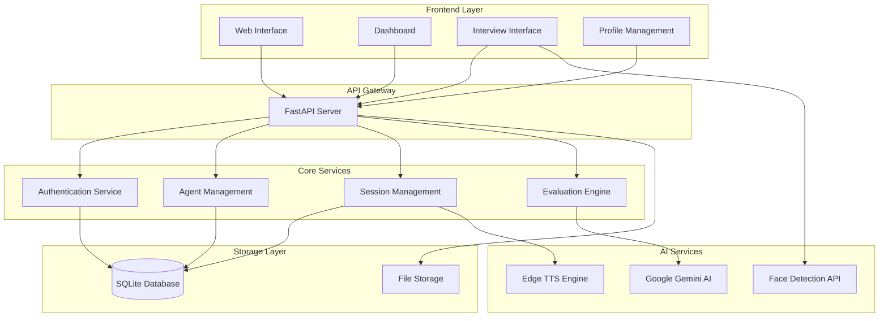

# Design Document

## Overview

The AI Agent Interviewer Builder Platform is architected as a modern web-based SaaS solution with a FastAPI backend and responsive HTML/CSS/JavaScript frontend. The system leverages Google Gemini AI for intelligent conversation generation, Microsoft Edge TTS for multi-language voice synthesis, and face-api.js for real-time proctoring. The platform follows a microservices-inspired architecture with clear separation between authentication, agent management, interview orchestration, and evaluation services.

## Architecture

### System Architecture



### Technology Stack

**Backend:**
- FastAPI (Python) - REST API server with automatic OpenAPI documentation
- SQLAlchemy - ORM for database operations with relationship management
- SQLite - Lightweight database for development and small-scale deployment
- Passlib - Password hashing and verification with bcrypt
- Google Generative AI - Large language model for conversation and evaluation
- Edge TTS - Microsoft text-to-speech engine for multi-language support
- PyPDF - PDF parsing for resume text extraction

**Frontend:**
- Vanilla HTML5/CSS3/JavaScript - Lightweight, fast-loading interface
- Tailwind CSS - Utility-first CSS framework for responsive design
- Face-api.js - Browser-based face detection and expression analysis
- Chart.js - Data visualization for analytics dashboard
- WebRTC APIs - Camera/microphone access and media recording

**Infrastructure:**
- CORS middleware for cross-origin resource sharing
- Static file serving for media content
- File upload handling with UUID-based naming
- Environment variable configuration for API keys

## Components and Interfaces

### Authentication Component

**Purpose:** Manages user registration, login, and session management

**Key Methods:**
- `register(email, password)` - Creates new user account with hashed password
- `login(email, password)` - Validates credentials and returns user session
- `update_profile(user_id, full_name, company_name)` - Updates user profile information

**Database Schema:**
```sql
users (
    id: INTEGER PRIMARY KEY,
    email: STRING UNIQUE,
    password_hash: STRING,
    full_name: STRING,
    company_name: STRING,
    plan_type: STRING DEFAULT 'free',
    interview_usage: INTEGER DEFAULT 0,
    company_logo: STRING
)
```

### Agent Management Component

**Purpose:** Handles creation, configuration, and management of AI interview agents

**Key Methods:**
- `create_agent(user_id, name, role, rules_context, voice_id)` - Creates new AI agent
- `get_agents(user_id)` - Retrieves all agents for a user
- `get_agent(agent_id)` - Fetches specific agent configuration

**Database Schema:**
```sql
agents (
    id: INTEGER PRIMARY KEY,
    user_id: INTEGER FOREIGN KEY,
    name: STRING,
    role: STRING,
    rules_context: TEXT,
    voice_id: STRING DEFAULT 'en-US-AriaNeural'
)
```

**Business Logic:**
- Free plan users limited to 1 agent maximum
- Premium plan users have unlimited agent creation
- Agent configuration includes personality, evaluation criteria, and voice settings

### Interview Session Component

**Purpose:** Orchestrates complete interview lifecycle from initiation to completion

**Key Methods:**
- `start_interview(agent_id, candidate_info, language, resume)` - Initializes new session
- `chat(session_id, user_input)` - Processes candidate responses and generates AI replies
- `end_interview(session_id, emotion_log, cheat_count)` - Concludes session and triggers evaluation

**Database Schema:**
```sql
sessions (
    id: INTEGER PRIMARY KEY,
    agent_id: INTEGER FOREIGN KEY,
    candidate_name: STRING,
    candidate_email: STRING,
    language: STRING DEFAULT 'English',
    resume_text: TEXT,
    resume_path: STRING,
    start_time: DATETIME,
    final_score: INTEGER DEFAULT 0,
    recommendation: STRING DEFAULT 'Pending',
    feedback: TEXT,
    recording_url: STRING,
    cheat_count: INTEGER DEFAULT 0
)
```

**Workflow:**
1. Session initialization with candidate data and resume parsing
2. AI greeting generation based on role, context, and resume
3. Interactive conversation with question progression (max 7 questions)
4. Real-time proctoring and violation tracking
5. Session termination and evaluation trigger

### AI Engine Component

**Purpose:** Provides intelligent conversation generation and candidate evaluation

**Key Methods:**
- `generate_greeting(role, rules, candidate_name, language, resume_text)` - Creates personalized opening
- `generate_response(role, rules, history, question_count, language, resume_text)` - Generates contextual questions
- `generate_final_report(history, rules, emotion_log)` - Produces comprehensive evaluation

**Features:**
- Multi-model support (Gemini 2.5 Flash with Pro fallback)
- API key rotation for rate limit management
- Context-aware conversation flow
- Structured JSON evaluation output

### Proctoring System Component

**Purpose:** Real-time monitoring of interview integrity through computer vision

**Detection Capabilities:**
- Face presence validation
- Multiple person detection
- Eye tracking and attention monitoring
- Browser tab switching detection
- Facial expression analysis for confidence scoring

**Violation Handling:**
- Three-strike termination policy
- Real-time warning display
- Violation logging with timestamps
- Automatic session termination on excessive violations

### Voice Engine Component

**Purpose:** Multi-language text-to-speech conversion for AI agent responses

**Supported Languages:**
- English (en-US-AriaNeural)
- Burmese (my-MM-ThihaNeural)
- Spanish (es-ES-ElviraNeural)
- French (fr-FR-DeniseNeural)
- German (de-DE-KatjaNeural)
- Hindi (hi-IN-SwaraNeural)
- Japanese (ja-JP-NanamiNeural)

**Implementation:**
- Edge TTS integration for high-quality voice synthesis
- Dynamic voice selection based on interview language
- Audio file generation with UUID-based naming
- Streaming audio playback in browser interface

## Data Models

### User Model
```python
class User:
    id: int
    email: str (unique)
    password_hash: str
    full_name: str
    company_name: str
    plan_type: str  # 'free' or 'premium'
    interview_usage: int
    company_logo: str  # URL to uploaded logo
    agents: List[Agent]  # One-to-many relationship
```

### Agent Model
```python
class Agent:
    id: int
    user_id: int
    name: str
    role: str
    rules_context: str  # Interview guidelines and evaluation criteria
    voice_id: str
    owner: User  # Many-to-one relationship
    sessions: List[InterviewSession]  # One-to-many relationship
```

### Interview Session Model
```python
class InterviewSession:
    id: int
    agent_id: int
    candidate_name: str
    candidate_email: str
    language: str
    resume_text: str  # Extracted from PDF
    resume_path: str  # File storage URL
    start_time: datetime
    final_score: int  # 0-100 evaluation score
    recommendation: str  # Hiring recommendation
    feedback: str  # Detailed evaluation text
    recording_url: str  # Video recording location
    cheat_count: int  # Proctoring violations
    agent: Agent  # Many-to-one relationship
    messages: List[Message]  # One-to-many relationship
```

### Message Model
```python
class Message:
    id: int
    session_id: int
    role: str  # 'ai' or 'user'
    content: str
    timestamp: datetime
    session: InterviewSession  # Many-to-one relationship
```

## Correctness Properties

*A property is a characteristic or behavior that should hold true across all valid executions of a system-essentially, a formal statement about what the system should do. Properties serve as the bridge between human-readable specifications and machine-verifiable correctness guarantees.*

### Property 1: User Registration and Authentication
*For any* valid email and password combination, registering a new user should create an account with default free plan, and subsequent login with those credentials should grant access while invalid credentials should be rejected.
**Validates: Requirements 1.1, 1.2, 1.3**

### Property 2: Profile Data Persistence
*For any* user profile information (full name, company name, plan type), storing and updating the data should result in the same information being retrievable from the system.
**Validates: Requirements 1.4, 1.5**

### Property 3: Agent Creation and Configuration
*For any* valid agent configuration (name, role, rules, voice), creating an agent should store all configuration data correctly and make it retrievable.
**Validates: Requirements 2.1, 2.2, 2.3, 2.6**

### Property 4: Plan-Based Agent Limits
*For any* user with a free plan, attempting to create more than one agent should be prevented, while premium plan users should be able to create unlimited agents.
**Validates: Requirements 2.4, 2.5**

### Property 5: Interview Session Initialization
*For any* valid candidate information (name, email, language), starting an interview session should create a session with all provided data and generate an appropriate AI greeting.
**Validates: Requirements 3.1, 3.3**

### Property 6: Resume Parsing Round Trip
*For any* valid resume content, creating a PDF file, uploading it to the platform, and extracting the text should produce content equivalent to the original.
**Validates: Requirements 3.2, 10.3**

### Property 7: Interview Conversation Flow
*For any* interview session, providing candidate responses should generate AI follow-ups, and reaching exactly seven questions should trigger session conclusion.
**Validates: Requirements 3.4, 3.5**

### Property 8: Multi-Language Support
*For any* supported language (English, Burmese, Spanish, French, German, Hindi, Japanese), conducting an interview should use the appropriate voice, maintain conversation context, and generate reports in the same language.
**Validates: Requirements 3.6, 8.1, 8.2, 8.3, 8.4, 8.5**

### Property 9: Proctoring Violation Detection
*For any* cheating behavior (no face, multiple faces, looking away, tab switching), the proctoring system should log violations and display warnings, with three violations triggering interview termination.
**Validates: Requirements 4.1, 4.2, 4.3, 4.4, 4.5, 4.6, 4.7**

### Property 10: Recording and Audio Generation
*For any* interview session, starting the session should begin recording, AI responses should generate audio files with correct voice settings, and ending the session should save recordings with accessible URLs.
**Validates: Requirements 5.1, 5.2, 5.3, 5.4**

### Property 11: Evaluation Engine Completeness
*For any* completed interview, the evaluation engine should analyze the transcript, consider emotion data, generate a score between 0-100, provide a valid recommendation, create feedback text, and factor in violation counts.
**Validates: Requirements 6.1, 6.2, 6.3, 6.4, 6.5, 6.6**

### Property 12: SaaS Plan Enforcement
*For any* free plan user, the system should enforce limits of 1 agent and 5 interviews, prevent exceeding limits with upgrade suggestions, while premium users should have no restrictions, and plan upgrades should immediately remove limits.
**Validates: Requirements 7.1, 7.2, 7.3, 7.4, 7.5**

### Property 13: Dashboard Analytics Accuracy
*For any* user with interview data, the dashboard should display correct total counts, outcome distributions, usage against limits, session metadata, and provide access to recordings and reports.
**Validates: Requirements 7.6, 9.1, 9.2, 9.3, 9.4, 9.5**

### Property 14: File Upload and Serving
*For any* supported file format (PNG, JPG, PDF), uploading files should store them correctly, generate secure accessible URLs, and apply uploaded logos/photos to appropriate branding and profiles.
**Validates: Requirements 9.6, 10.1, 10.2, 10.4, 10.5**

## Error Handling

### Authentication Errors
- Invalid credentials return appropriate HTTP 400 status with descriptive messages
- Duplicate email registration attempts are rejected with clear error indication
- Password hashing failures fall back to plain text comparison for backward compatibility

### AI Service Errors
- Google Gemini API failures trigger automatic key rotation across multiple API keys
- Rate limiting (429 errors) automatically switch to alternative API keys
- Model unavailability falls back from Gemini 2.5 Flash to Gemini Pro
- Complete AI service failure returns graceful fallback responses

### File Upload Errors
- Unsupported file formats are rejected with clear error messages
- File size limits prevent system resource exhaustion
- Corrupted PDF files fail gracefully during text extraction
- Missing files return appropriate 404 responses

### Proctoring System Errors
- Camera access denial gracefully degrades to text-only interview mode
- Face detection library failures log errors but continue interview
- Browser compatibility issues provide fallback detection methods

### Database Errors
- Connection failures implement retry logic with exponential backoff
- Constraint violations return user-friendly error messages
- Transaction failures trigger automatic rollback to maintain data consistency

## Testing Strategy

### Dual Testing Approach

The platform requires both unit testing and property-based testing for comprehensive coverage:

**Unit Tests** focus on:
- Specific authentication scenarios (valid/invalid credentials)
- File upload edge cases (corrupted files, unsupported formats)
- API endpoint error responses
- Database constraint violations
- Integration points between components

**Property Tests** focus on:
- Universal properties that hold across all inputs
- Data consistency and round-trip operations
- Business rule enforcement across different scenarios
- Cross-language functionality validation
- Comprehensive input coverage through randomization

### Property-Based Testing Configuration

- **Framework**: Hypothesis (Python) for backend property tests, fast-check (JavaScript) for frontend
- **Test Iterations**: Minimum 100 iterations per property test
- **Test Tagging**: Each property test references its design document property
- **Tag Format**: **Feature: ai-interviewer-platform, Property {number}: {property_text}**

### Testing Coverage Requirements

**Authentication Testing:**
- Property tests for credential validation across random email/password combinations
- Unit tests for specific edge cases (empty fields, SQL injection attempts)

**Agent Management Testing:**
- Property tests for agent creation with random configurations
- Unit tests for plan limit enforcement edge cases

**Interview Flow Testing:**
- Property tests for conversation flow with random candidate responses
- Unit tests for specific proctoring violation scenarios

**Multi-Language Testing:**
- Property tests across all supported languages with random content
- Unit tests for specific language switching scenarios

**File Processing Testing:**
- Property tests for resume parsing round-trip validation
- Unit tests for specific file format handling and error conditions

Each correctness property must be implemented by a single property-based test that validates the universal behavior across all valid inputs, while unit tests handle specific examples and edge cases that demonstrate correct system behavior.